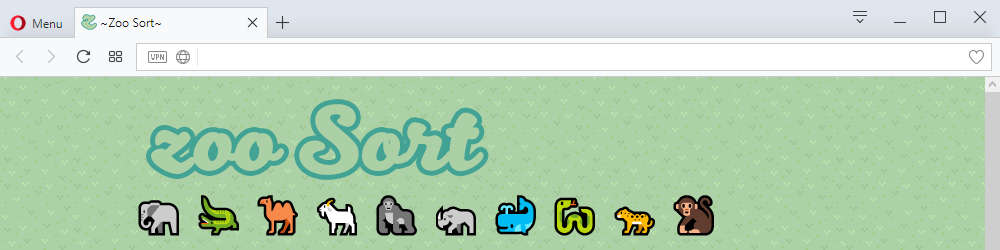
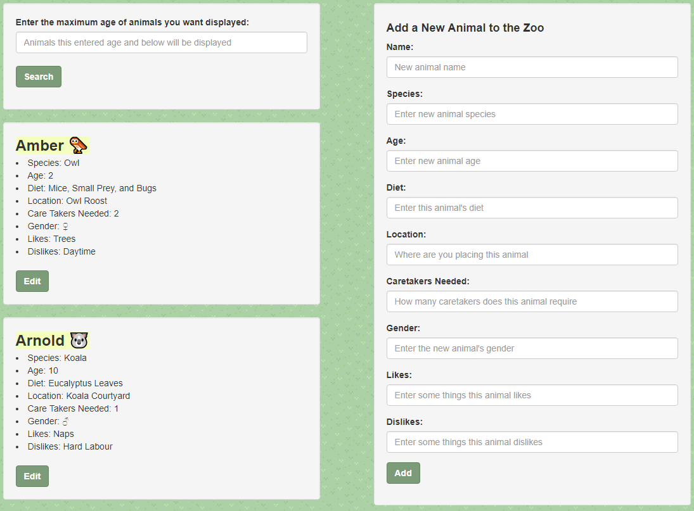

# Zoo Sort
🦑━━━━━━━━━━━━━━━━━

#### Zoo Sort, September 22, 2017
🐘━━━━━━━━━━━━━━━━━

#### By `Kira Loo`
🐃━━━━━━━━━━━━━━━━━

## Description
🐅━━━━━━━━━━━━━━━━━

_Can't seem to keep track of all your pesky zoo animals running around? Yeah, me as well..._

_Good thing `zoo Sort` is here to help you sort all those animals, and even let you add new ones to you up and coming zoo!_  

## Setup/Installation Requirements
🐬━━━━━━━━━━━━━━━━━

You will need npm, TypeScript, Gulp and Bower installed on your device.

* ->🦌 Clone the repo from git hub.
* ->🦃 Open in your favorite editor
* ->🐆 Run with -> npm install  -> bower install -> gulp build -> gulp serve
* ->🐟 Site should now be launched in your favorite browser on localhost:3000
* ->🦆 Have at it ~

## Specifications
🐧━━━━━━━━━━━━━━━━━

| 🐣 Behavior      | 🐤 Example Input      | 🐥 Example Output       |
| ------------- | ------------- | ------------- |
|Access Site | No action required| All current animals are displayed.|
| ------------- | ------------- | ------------- |
|Enter the maximum age of animals you want displayed| "5" | All animals age 5 and under are returned.|
| ------------- | ------------- | ------------- |
|Edit an existing animal | "Edit Amber -> New name: 'Gabe' "| "Original Name: Amber -> Updated to Gabe"|
| ------------- | ------------- | ------------- |
| Done Editing | "Click Done" | "Editing menu disappears" |
| ------------- | ------------- | ------------- |
| Add a new animal zoo | "Enter in new animal details" | "New animal is added to the list of all animals and is now specifically searchable" |
| ━━━━━━━━━━━━ | ━━━━━━━━━━━━ | ━━━━━━━━━━━━ |

## Technologies Used
🐍━━━━━━━━━━━━━━━━━

* _Atom_
* _JavaScript_
* _npm_
* _Angular_
* _TypeScript_
* _Bower_
* _Gulp_
* _Adobe Photoshop_

### License
🦍━━━━━━━━━━━━━━━━━
Copyright &copy; 2017 _Kira Loo_
